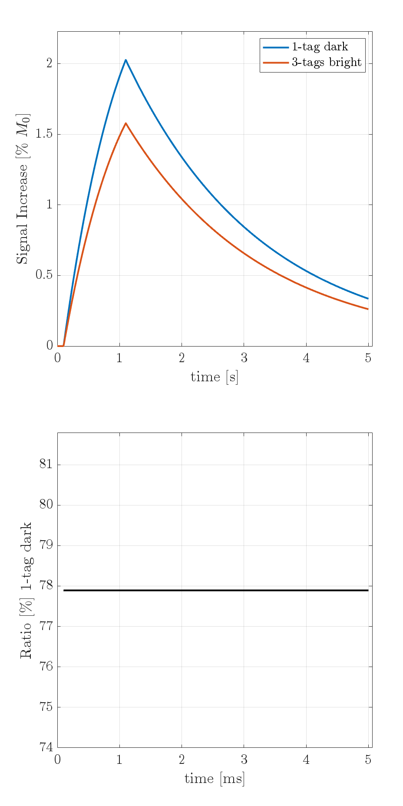

# General Kinetic Model for Time-SLIP



## Overview

This repository contains MATLAB code for simulating and analyzing the signal ratio between dark Time-SLIP and multi-tag bright or dark sequences using the generalized kinetic model (GKM). The main function, `gkmMultiTagTSLIP`, calculates the signal ratio based on various input parameters, including T1 relaxation time, tagging pulses, labeling efficiency, and blood flow dynamics.

## Main Function: `gkmMultiTagTSLIP`

### Description

The `gkmMultiTagTSLIP` function calculates the signal ratio between dark Time-SLIP and multi-tag bright or dark sequences in arterial spin labeling (ASL) experiments.

- **Dark Sequence**: The first tag is at `t=0`, followed by additional tags at specified time points.
- **Bright Sequence**: The first tag is non-selective at `t=0`, followed by additional tags at specified time points.

### Inputs

- **`T1`** (`double`): T1 relaxation time in milliseconds.
- **`pulses`** (`[double]`): Array of time points for tagging pulses `[t1, t2, ... tn]` in milliseconds.
- **`type`** (`string`): Sequence type, either `'dark'` (select) or `'bright'` (nselect + select).
- **`alpha`** (`double`): Labeling efficiency.
- **`gkmParam`** (`[double]`): Array containing `[f, delta_t, tau]`, where:
  - `f`: Cerebral Blood Flow (CBF) in ml of perfusive substance per ml tissue per second.
  - `delta_t`: Transit delay in milliseconds.
  - `tau`: Perfusion duration in milliseconds.
- **`showplot`** (`boolean`): If `true`, the function will display a plot of the results.

### Outputs

- **`ratio`** (`double`): Signal ratio between the bright or dark sequence compared to a single dark tag.

### Example Usage

```matlab
T1 = 1200;                    % T1 relaxation time [ms]
pulses = [500, 1000, 1500];   % Tag pulses timing [ms]
type = 'bright';              % Sequence type: 'dark' or 'bright'
alpha = 0.85;                 % Labeling efficiency
gkmParam = [0.01, 500, 1000]; % [f, delta_t, tau]
showplot = true;              % Show plot

ratio = gkmMultiTagTSLIP(T1, pulses, type, alpha, gkmParam, showplot);
